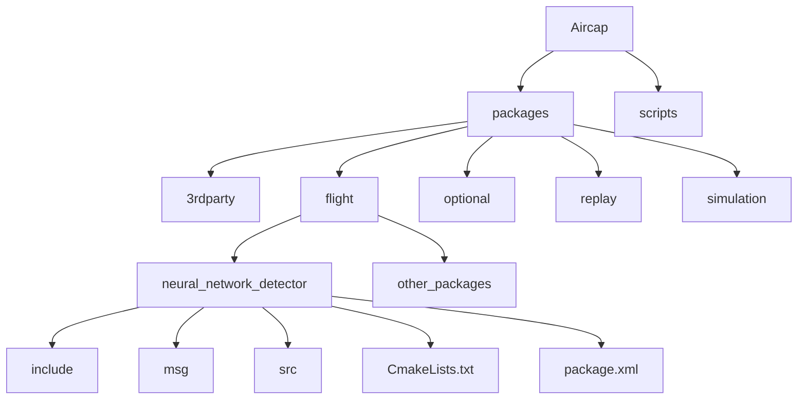
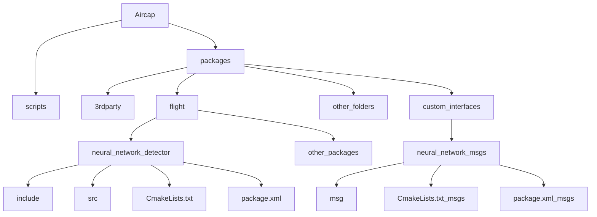

# Background

In this file, there will be a working example for separating the custom msgs into a single package.
The example we are working on is from the public repository 
[GitHub - robot-perception-group/AirCap](https://github.com/robot-perception-group/AirCap/tree/13f9a25f06e863e55a469ff7dd54cbf6).
We will separate the neural_network_detector msgs into a package called neural_network_msgs.

# Analysis

## Workspace original hierarchy:



In the neural_network_detector package, there is a msg folder containing all the defined custom messages.

We will create a sub-folder of packages called custom_interfaces, inside which we will create the neural_network_msgs package and any other custom messages you want but lets continue with the neural network one. Inside the neural_network_msg, create a folder called msg and put all .msg definitions and copy the CmakeLists.txt and the package.xml from the neural_network_detector into it as follows



## Editing the CmakeLists.txt and package.xml:

We will do as mentioned here:

[How to add custom messages to ros-jazzy-ros1-bridge](https://www.notion.so/How-to-add-custom-messages-to-ros-jazzy-ros1-bridge-208896024ee58058bc97e1d2f936b701?pvs=21)

### Original CmakeLists.txt:

```bash
CMAKE_MINIMUM_REQUIRED(VERSION 2.8.3)
PROJECT(neural_network_detector)

IF(NOT CMAKE_BUILD_TYPE)
  SET(CMAKE_BUILD_TYPE "Release")
ENDIF()

MESSAGE("Build type: " ${CMAKE_BUILD_TYPE})

set(CMAKE_C_FLAGS "${CMAKE_C_FLAGS} -Wall -O3")
set(CMAKE_CXX_FLAGS "${CMAKE_CXX_FLAGS} -Wall -O3")

# Check C++11 or C++0x support
include(CheckCXXCompilerFlag)
CHECK_CXX_COMPILER_FLAG("-std=c++11" COMPILER_SUPPORTS_CXX11)
CHECK_CXX_COMPILER_FLAG("-std=c++0x" COMPILER_SUPPORTS_CXX0X)
if(COMPILER_SUPPORTS_CXX11)
   set(CMAKE_CXX_FLAGS "${CMAKE_CXX_FLAGS} -std=c++11")
   add_definitions(-DCOMPILEDWITHC11)
   message(STATUS "Using flag -std=c++11.")
elseif(COMPILER_SUPPORTS_CXX0X)
   set(CMAKE_CXX_FLAGS "${CMAKE_CXX_FLAGS} -std=c++0x")
   add_definitions(-DCOMPILEDWITHC0X)
   message(STATUS "Using flag -std=c++0x.")
else()
   message(FATAL_ERROR "The compiler ${CMAKE_CXX_COMPILER} has no C++11 support. Please use a different C++ compiler.")
endif()

## Third party modules
FIND_PACKAGE(cmake_modules REQUIRED)
FIND_PACKAGE(OpenCV REQUIRED)
INCLUDE_DIRECTORIES(${catkin_INCLUDE_DIRS} ${OpenCV_INCLUDE_DIRS})
MESSAGE(STATUS "OpenCV_INCLUDE_DIRS   =      " ${OpenCV_INCLUDE_DIRS})

FIND_PACKAGE(Boost COMPONENTS system thread REQUIRED)
INCLUDE_DIRECTORIES(${Boost_INCLUDE_DIRS})

## Find catkin macros and libraries
## if COMPONENTS list like find_package(catkin REQUIRED COMPONENTS xyz)
## is used, also find other catkin packages
FIND_PACKAGE(catkin REQUIRED COMPONENTS
  cv_bridge
  image_transport
  roscpp
  sensor_msgs
  std_msgs
  message_generation
  message_filters
  )

## System dependencies are found with CMake's conventions
# find_package(Boost REQUIRED COMPONENTS system)

## Uncomment this if the package has a setup.py. This macro ensures
## modules and global scripts declared therein get installed
## See http://ros.org/doc/api/catkin/html/user_guide/setup_dot_py.html
# catkin_python_setup()

################################################
## Declare ROS messages, services and actions ##
################################################

## To declare and build messages, services or actions from within this
## package, follow these steps:
## * Let MSG_DEP_SET be the set of packages whose message types you use in
##   your messages/services/actions (e.g. std_msgs, actionlib_msgs, ...).
## * In the file package.xml:
##   * add a build_depend tag for "message_generation"
##   * add a build_depend and a run_depend tag for each package in MSG_DEP_SET
##   * If MSG_DEP_SET isn't empty the following dependency has been pulled in
##     but can be declared for certainty nonetheless:
##     * add a run_depend tag for "message_runtime"
## * In this file (CMakeLists.txt):
##   * add "message_generation" and every package in MSG_DEP_SET to
##     find_package(catkin REQUIRED COMPONENTS ...)
##   * add "message_runtime" and every package in MSG_DEP_SET to
##     catkin_package(CATKIN_DEPENDS ...)
##   * uncomment the add_*_files sections below as needed
##     and list every .msg/.srv/.action file to be processed
##   * uncomment the generate_messages entry below
##   * add every package in MSG_DEP_SET to generate_messages(DEPENDENCIES ...)

## Generate messages in the 'msg' folder
ADD_MESSAGE_FILES(
  DIRECTORY msg
  FILES NeuralNetworkDetection.msg NeuralNetworkDetectionArray.msg NeuralNetworkFeedback.msg NeuralNetworkNumberOfDetections.msg
)

## Generate services in the 'srv' folder
# add_service_files(
#   FILES
#   Service1.srv
#   Service2.srv
# )

## Generate actions in the 'action' folder
# add_action_files(
#   FILES
#   Action1.action
#   Action2.action
# )

## Generate added messages and services with any dependencies listed here
GENERATE_MESSAGES(
  DEPENDENCIES
  std_msgs
  neural_network_detector
)

################################################
## Declare ROS dynamic reconfigure parameters ##
################################################

## To declare and build dynamic reconfigure parameters within this
## package, follow these steps:
## * In the file package.xml:
##   * add a build_depend and a run_depend tag for "dynamic_reconfigure"
## * In this file (CMakeLists.txt):
##   * add "dynamic_reconfigure" to
##     find_package(catkin REQUIRED COMPONENTS ...)
##   * uncomment the "generate_dynamic_reconfigure_options" section below
##     and list every .cfg file to be processed

## Generate dynamic reconfigure parameters in the 'cfg' folder
# generate_dynamic_reconfigure_options(
#   cfg/DynReconf1.cfg
#   cfg/DynReconf2.cfg
# )

###################################
## catkin specific configuration ##
###################################
## The catkin_package macro generates cmake config files for your package
## Declare things to be passed to dependent projects
## INCLUDE_DIRS: uncomment this if you package contains header files
## LIBRARIES: libraries you create in this project that dependent projects also need
## CATKIN_DEPENDS: catkin_packages dependent projects also need
## DEPENDS: system dependencies of this project that dependent projects also need
CATKIN_PACKAGE(
  INCLUDE_DIRS include
  # LIBRARIES NNClient
  CATKIN_DEPENDS message_runtime std_msgs
  #  DEPENDS system_lib
)

###########
## Build ##
###########

## Specify additional locations of header files
## Your package locations should be listed before other locations
# include_directories(include)
INCLUDE_DIRECTORIES(
  include
  ${catkin_INCLUDE_DIRS}
  ${OpenCV_INCLUDE_DIRS}
  ${Boost_INCLUDE_DIRS}
)

## Declare a C++ library
#ADD_LIBRARY(NNClient
#  src/NNClient.cpp include/neural_network_detector/NNClient.h)

## Add cmake target dependencies of the library
## as an example, code may need to be generated before libraries
## either from message generation or dynamic reconfigure
# add_dependencies(${PROJECT_NAME} ${${PROJECT_NAME}_EXPORTED_TARGETS} ${catkin_EXPORTED_TARGETS})

## Declare a C++ executable
## With catkin_make all packages are built within a single CMake context
## The recommended prefix ensures that target names across packages don't collide
ADD_EXECUTABLE(${PROJECT_NAME}_node
  src/NNDetector.cpp
  include/neural_network_detector/NNDetector.h
  include/neural_network_detector/BoostTCPClient.h
  #src/NNClient.cpp
  #include/neural_network_detector/NNClient.h
  include/cv/extensions/projection.h src/neural_network_detector_node.cpp)

ADD_EXECUTABLE(${PROJECT_NAME}_overlay_only
  src/Overlay.cpp
  include/neural_network_detector/Overlay.h
  include/cv/extensions/projection.h
  src/NNDetector.cpp
  include/neural_network_detector/NNDetector.h src/neural_network_detector_overlay_only.cpp)

## Rename C++ executable without prefix
## The above recommended prefix causes long target names, the following renames the
## target back to the shorter version for ease of user use
## e.g. "rosrun someones_pkg node" instead of "rosrun someones_pkg someones_pkg_node"
# set_target_properties(${PROJECT_NAME}_node PROPERTIES OUTPUT_NAME node PREFIX "")

## Add cmake target dependencies of the executable
## same as for the library above
add_dependencies(${PROJECT_NAME}_node ${${PROJECT_NAME}_EXPORTED_TARGETS} ${catkin_EXPORTED_TARGETS})
add_dependencies(${PROJECT_NAME}_overlay_only ${${PROJECT_NAME}_EXPORTED_TARGETS} ${catkin_EXPORTED_TARGETS})

# Specify libraries to link a library or executable target against
TARGET_LINK_LIBRARIES(${PROJECT_NAME}_node
  ${catkin_LIBRARIES}
  ${Boost_LIBRARIES}
  ${OpenCV_LIBRARIES}
  )

TARGET_LINK_LIBRARIES(${PROJECT_NAME}_overlay_only
  ${catkin_LIBRARIES}
  ${Boost_LIBRARIES}
  ${OpenCV_LIBRARIES}
  )

#############
## Install ##
#############

# all install targets should use catkin DESTINATION variables
# See http://ros.org/doc/api/catkin/html/adv_user_guide/variables.html

## Mark executable scripts (Python etc.) for installation
## in contrast to setup.py, you can choose the destination
# install(PROGRAMS
#   scripts/my_python_script
#   DESTINATION ${CATKIN_PACKAGE_BIN_DESTINATION}
# )

## Mark executables and/or libraries for installation
# install(TARGETS ${PROJECT_NAME} ${PROJECT_NAME}_node
#   ARCHIVE DESTINATION ${CATKIN_PACKAGE_LIB_DESTINATION}
#   LIBRARY DESTINATION ${CATKIN_PACKAGE_LIB_DESTINATION}
#   RUNTIME DESTINATION ${CATKIN_PACKAGE_BIN_DESTINATION}
# )

## Mark cpp header files for installation
# install(DIRECTORY include/${PROJECT_NAME}/
#   DESTINATION ${CATKIN_PACKAGE_INCLUDE_DESTINATION}
#   FILES_MATCHING PATTERN "*.h"
#   PATTERN ".svn" EXCLUDE
# )

## Mark other files for installation (e.g. launch and bag files, etc.)
# install(FILES
#   # myfile1
#   # myfile2
#   DESTINATION ${CATKIN_PACKAGE_SHARE_DESTINATION}
# )

#############
## Testing ##
#############

## Add gtest based cpp test target and link libraries
# catkin_add_gtest(${PROJECT_NAME}-test test/test_neural_network_detector.cpp)
# if(TARGET ${PROJECT_NAME}-test)
#   target_link_libraries(${PROJECT_NAME}-test ${PROJECT_NAME})
# endif()

## Add folders to be run by python nosetests
# catkin_add_nosetests(test)
```

### Original package.xml:

```xml
<?xml version="1.0"?>
<package>
    <name>neural_network_detector</name>
    <version>0.0.0</version>
    <description>The neural_network_detector package</description>

    <!-- One maintainer tag required, multiple allowed, one person per tag -->
    <!-- Example:  -->
    <!-- <maintainer email="jane.doe@example.com">Jane Doe</maintainer> -->
    <maintainer email="guilherme.lawless@tuebingen.mpg.de">Guilherme Lawless</maintainer>

    <!-- One license tag required, multiple allowed, one license per tag -->
    <!-- Commonly used license strings: -->
    <!--   BSD, MIT, Boost Software License, GPLv2, GPLv3, LGPLv2.1, LGPLv3 -->
    <license>GPLv3</license>

    <!-- Url tags are optional, but multiple are allowed, one per tag -->
    <!-- Optional attribute type can be: website, bugtracker, or repository -->
    <!-- Example: -->
    <!-- <url type="website">http://wiki.ros.org/neural_network_detector</url> -->

    <!-- Author tags are optional, multiple are allowed, one per tag -->
    <!-- Authors do not have to be maintainers, but could be -->
    <!-- Example: -->
    <!-- <author email="jane.doe@example.com">Jane Doe</author> -->

    <!-- The *_depend tags are used to specify dependencies -->
    <!-- Dependencies can be catkin packages or system dependencies -->
    <!-- Examples: -->
    <!-- Use build_depend for packages you need at compile time: -->
    <!--   <build_depend>message_generation</build_depend> -->
    <!-- Use buildtool_depend for build tool packages: -->
    <!--   <buildtool_depend>catkin</buildtool_depend> -->
    <!-- Use run_depend for packages you need at runtime: -->
    <!--   <run_depend>message_runtime</run_depend> -->
    <!-- Use test_depend for packages you need only for testing: -->
    <!--   <test_depend>gtest</test_depend> -->
    <buildtool_depend>catkin</buildtool_depend>
    <build_depend>cv_bridge</build_depend>
    <build_depend>image_transport</build_depend>
    <build_depend>roscpp</build_depend>
    <build_depend>sensor_msgs</build_depend>
    <build_depend>std_msgs</build_depend>
    <build_depend>message_filters</build_depend>
    <build_depend>message_generation</build_depend>
    <run_depend>cv_bridge</run_depend>
    <run_depend>image_transport</run_depend>
    <run_depend>roscpp</run_depend>
    <run_depend>sensor_msgs</run_depend>
    <run_depend>std_msgs</run_depend>
    <run_depend>message_filters</run_depend>
    <run_depend>message_runtime</run_depend>

    <!-- The export tag contains other, unspecified, tags -->
    <export>
        <!-- Other tools can request additional information be placed here -->

    </export>
</package>
```

Starting in the neural_network_detector package. We will remove any dependency or function for creating custom messages in the CmakeLists.txt and package.xml.

We will also add the neural_network_msgs package as a dependency in the FIND_PACKAGE and in the CATKIN_PACKAGE( CATKIN_DEPENDS ……..)

### detector CmakeLists.txt:

```bash
CMAKE_MINIMUM_REQUIRED(VERSION 2.8.3)
PROJECT(neural_network_detector)

IF(NOT CMAKE_BUILD_TYPE)
  SET(CMAKE_BUILD_TYPE "Release")
ENDIF()

MESSAGE("Build type: " ${CMAKE_BUILD_TYPE})

set(CMAKE_C_FLAGS "${CMAKE_C_FLAGS} -Wall -O3")
set(CMAKE_CXX_FLAGS "${CMAKE_CXX_FLAGS} -Wall -O3")

# Check C++11 or C++0x support
include(CheckCXXCompilerFlag)
CHECK_CXX_COMPILER_FLAG("-std=c++11" COMPILER_SUPPORTS_CXX11)
CHECK_CXX_COMPILER_FLAG("-std=c++0x" COMPILER_SUPPORTS_CXX0X)
if(COMPILER_SUPPORTS_CXX11)
   set(CMAKE_CXX_FLAGS "${CMAKE_CXX_FLAGS} -std=c++11")
   add_definitions(-DCOMPILEDWITHC11)
   message(STATUS "Using flag -std=c++11.")
elseif(COMPILER_SUPPORTS_CXX0X)
   set(CMAKE_CXX_FLAGS "${CMAKE_CXX_FLAGS} -std=c++0x")
   add_definitions(-DCOMPILEDWITHC0X)
   message(STATUS "Using flag -std=c++0x.")
else()
   message(FATAL_ERROR "The compiler ${CMAKE_CXX_COMPILER} has no C++11 support. Please use a different C++ compiler.")
endif()

## Third party modules
FIND_PACKAGE(cmake_modules REQUIRED)
FIND_PACKAGE(OpenCV REQUIRED)
INCLUDE_DIRECTORIES(${catkin_INCLUDE_DIRS} ${OpenCV_INCLUDE_DIRS})
MESSAGE(STATUS "OpenCV_INCLUDE_DIRS   =      " ${OpenCV_INCLUDE_DIRS})

FIND_PACKAGE(Boost COMPONENTS system thread REQUIRED)
INCLUDE_DIRECTORIES(${Boost_INCLUDE_DIRS})

## Find catkin macros and libraries
## if COMPONENTS list like find_package(catkin REQUIRED COMPONENTS xyz)
## is used, also find other catkin packages
FIND_PACKAGE(catkin REQUIRED COMPONENTS
  cv_bridge
  image_transport
  roscpp
  sensor_msgs
  std_msgs
  message_filters
  **neural_network_msgs**
  )

## System dependencies are found with CMake's conventions
# find_package(Boost REQUIRED COMPONENTS system)

## Uncomment this if the package has a setup.py. This macro ensures
## modules and global scripts declared therein get installed
## See http://ros.org/doc/api/catkin/html/user_guide/setup_dot_py.html
# catkin_python_setup()

################################################
## Declare ROS messages, services and actions ##
################################################

## To declare and build messages, services or actions from within this
## package, follow these steps:
## * Let MSG_DEP_SET be the set of packages whose message types you use in
##   your messages/services/actions (e.g. std_msgs, actionlib_msgs, ...).
## * In the file package.xml:
##   * add a build_depend tag for "message_generation"
##   * add a build_depend and a run_depend tag for each package in MSG_DEP_SET
##   * If MSG_DEP_SET isn't empty the following dependency has been pulled in
##     but can be declared for certainty nonetheless:
##     * add a run_depend tag for "message_runtime"
## * In this file (CMakeLists.txt):
##   * add "message_generation" and every package in MSG_DEP_SET to
##     find_package(catkin REQUIRED COMPONENTS ...)
##   * add "message_runtime" and every package in MSG_DEP_SET to
##     catkin_package(CATKIN_DEPENDS ...)
##   * uncomment the add_*_files sections below as needed
##     and list every .msg/.srv/.action file to be processed
##   * uncomment the generate_messages entry below
##   * add every package in MSG_DEP_SET to generate_messages(DEPENDENCIES ...)

## Generate services in the 'srv' folder
# add_service_files(
#   FILES
#   Service1.srv
#   Service2.srv
# )

## Generate actions in the 'action' folder
# add_action_files(
#   FILES
#   Action1.action
#   Action2.action
# )

################################################
## Declare ROS dynamic reconfigure parameters ##
################################################

## To declare and build dynamic reconfigure parameters within this
## package, follow these steps:
## * In the file package.xml:
##   * add a build_depend and a run_depend tag for "dynamic_reconfigure"
## * In this file (CMakeLists.txt):
##   * add "dynamic_reconfigure" to
##     find_package(catkin REQUIRED COMPONENTS ...)
##   * uncomment the "generate_dynamic_reconfigure_options" section below
##     and list every .cfg file to be processed

## Generate dynamic reconfigure parameters in the 'cfg' folder
# generate_dynamic_reconfigure_options(
#   cfg/DynReconf1.cfg
#   cfg/DynReconf2.cfg
# )

###################################
## catkin specific configuration ##
###################################
## The catkin_package macro generates cmake config files for your package
## Declare things to be passed to dependent projects
## INCLUDE_DIRS: uncomment this if you package contains header files
## LIBRARIES: libraries you create in this project that dependent projects also need
## CATKIN_DEPENDS: catkin_packages dependent projects also need
## DEPENDS: system dependencies of this project that dependent projects also need
CATKIN_PACKAGE(
  INCLUDE_DIRS include
  # LIBRARIES NNClient
  CATKIN_DEPENDS message_runtime std_msgs **neural_network_msgs**
  #  DEPENDS system_lib
)

###########
## Build ##
###########

## Specify additional locations of header files
## Your package locations should be listed before other locations
# include_directories(include)
INCLUDE_DIRECTORIES(
  include
  ${catkin_INCLUDE_DIRS}
  ${OpenCV_INCLUDE_DIRS}
  ${Boost_INCLUDE_DIRS}
)

## Declare a C++ library
#ADD_LIBRARY(NNClient
#  src/NNClient.cpp include/neural_network_detector/NNClient.h)

## Add cmake target dependencies of the library
## as an example, code may need to be generated before libraries
## either from message generation or dynamic reconfigure
# add_dependencies(${PROJECT_NAME} ${${PROJECT_NAME}_EXPORTED_TARGETS} ${catkin_EXPORTED_TARGETS})

## Declare a C++ executable
## With catkin_make all packages are built within a single CMake context
## The recommended prefix ensures that target names across packages don't collide
ADD_EXECUTABLE(${PROJECT_NAME}_node
  src/NNDetector.cpp
  include/neural_network_detector/NNDetector.h
  include/neural_network_detector/BoostTCPClient.h
  #src/NNClient.cpp
  #include/neural_network_detector/NNClient.h
  include/cv/extensions/projection.h src/neural_network_detector_node.cpp)

ADD_EXECUTABLE(${PROJECT_NAME}_overlay_only
  src/Overlay.cpp
  include/neural_network_detector/Overlay.h
  include/cv/extensions/projection.h
  src/NNDetector.cpp
  include/neural_network_detector/NNDetector.h src/neural_network_detector_overlay_only.cpp)

## Rename C++ executable without prefix
## The above recommended prefix causes long target names, the following renames the
## target back to the shorter version for ease of user use
## e.g. "rosrun someones_pkg node" instead of "rosrun someones_pkg someones_pkg_node"
# set_target_properties(${PROJECT_NAME}_node PROPERTIES OUTPUT_NAME node PREFIX "")

## Add cmake target dependencies of the executable
## same as for the library above
add_dependencies(${PROJECT_NAME}_node ${${PROJECT_NAME}_EXPORTED_TARGETS} ${catkin_EXPORTED_TARGETS})
add_dependencies(${PROJECT_NAME}_overlay_only ${${PROJECT_NAME}_EXPORTED_TARGETS} ${catkin_EXPORTED_TARGETS})
add_dependencies(${PROJECT_NAME}_node  ${catkin_EXPORTED_TARGETS})

# Specify libraries to link a library or executable target against
TARGET_LINK_LIBRARIES(${PROJECT_NAME}_node
  ${catkin_LIBRARIES}
  ${Boost_LIBRARIES}
  ${OpenCV_LIBRARIES}
  )

TARGET_LINK_LIBRARIES(${PROJECT_NAME}_overlay_only
  ${catkin_LIBRARIES}
  ${Boost_LIBRARIES}
  ${OpenCV_LIBRARIES}
  )

#############
## Install ##
#############

# all install targets should use catkin DESTINATION variables
# See http://ros.org/doc/api/catkin/html/adv_user_guide/variables.html

## Mark executable scripts (Python etc.) for installation
## in contrast to setup.py, you can choose the destination
# install(PROGRAMS
#   scripts/my_python_script
#   DESTINATION ${CATKIN_PACKAGE_BIN_DESTINATION}
# )

## Mark executables and/or libraries for installation
# install(TARGETS ${PROJECT_NAME} ${PROJECT_NAME}_node
#   ARCHIVE DESTINATION ${CATKIN_PACKAGE_LIB_DESTINATION}
#   LIBRARY DESTINATION ${CATKIN_PACKAGE_LIB_DESTINATION}
#   RUNTIME DESTINATION ${CATKIN_PACKAGE_BIN_DESTINATION}
# )

## Mark cpp header files for installation
# install(DIRECTORY include/${PROJECT_NAME}/
#   DESTINATION ${CATKIN_PACKAGE_INCLUDE_DESTINATION}
#   FILES_MATCHING PATTERN "*.h"
#   PATTERN ".svn" EXCLUDE
# )

## Mark other files for installation (e.g. launch and bag files, etc.)
# install(FILES
#   # myfile1
#   # myfile2
#   DESTINATION ${CATKIN_PACKAGE_SHARE_DESTINATION}
# )

#############
## Testing ##
#############

## Add gtest based cpp test target and link libraries
# catkin_add_gtest(${PROJECT_NAME}-test test/test_neural_network_detector.cpp)
# if(TARGET ${PROJECT_NAME}-test)
#   target_link_libraries(${PROJECT_NAME}-test ${PROJECT_NAME})
# endif()

## Add folders to be run by python nosetests
# catkin_add_nosetests(test)

```

### Detector package.xml:

We will also add dependencies on the neural_network_msgs package

```xml
<?xml version="1.0"?>
<package>
    <name>neural_network_detector</name>
    <version>0.0.0</version>
    <description>The neural_network_detector package</description>

    <!-- One maintainer tag required, multiple allowed, one person per tag -->
    <!-- Example:  -->
    <!-- <maintainer email="jane.doe@example.com">Jane Doe</maintainer> -->
    <maintainer email="guilherme.lawless@tuebingen.mpg.de">Guilherme Lawless</maintainer>

    <!-- One license tag required, multiple allowed, one license per tag -->
    <!-- Commonly used license strings: -->
    <!--   BSD, MIT, Boost Software License, GPLv2, GPLv3, LGPLv2.1, LGPLv3 -->
    <license>GPLv3</license>

    <!-- Url tags are optional, but multiple are allowed, one per tag -->
    <!-- Optional attribute type can be: website, bugtracker, or repository -->
    <!-- Example: -->
    <!-- <url type="website">http://wiki.ros.org/neural_network_detector</url> -->

    <!-- Author tags are optional, multiple are allowed, one per tag -->
    <!-- Authors do not have to be maintainers, but could be -->
    <!-- Example: -->
    <!-- <author email="jane.doe@example.com">Jane Doe</author> -->

    <!-- The *_depend tags are used to specify dependencies -->
    <!-- Dependencies can be catkin packages or system dependencies -->
    <!-- Examples: -->
    <!-- Use build_depend for packages you need at compile time: -->
    <!--   <build_depend>message_generation</build_depend> -->
    <!-- Use buildtool_depend for build tool packages: -->
    <!--   <buildtool_depend>catkin</buildtool_depend> -->
    <!-- Use run_depend for packages you need at runtime: -->
    <!--   <run_depend>message_runtime</run_depend> -->
    <!-- Use test_depend for packages you need only for testing: -->
    <!--   <test_depend>gtest</test_depend> -->
    <buildtool_depend>catkin</buildtool_depend>
    <build_depend>cv_bridge</build_depend>
    <build_depend>image_transport</build_depend>
    <build_depend>roscpp</build_depend>
    <build_depend>sensor_msgs</build_depend>
    <build_depend>std_msgs</build_depend>
    <build_depend>message_filters</build_depend>
    <run_depend>cv_bridge</run_depend>
    <run_depend>image_transport</run_depend>
    <run_depend>roscpp</run_depend>
    <run_depend>sensor_msgs</run_depend>
    <run_depend>std_msgs</run_depend>
    <run_depend>message_filters</run_depend>

    ***<build_depend>neural_network_msgs</build_depend>
    <run_depend>neural_network_msgs</run_depend>***
    
    <!-- The export tag contains other, unspecified, tags -->
    <export>
        <!-- Other tools can request additional information be placed here -->

    </export>
</package>

```

### neural_network_msgs CmakeLists.txt:

Remove all other dependencies except for the messages one. 

Note: leave the CATKIN_PACKAGE( CATKIN_DEPENDS ……) part.

```bash
CMAKE_MINIMUM_REQUIRED(VERSION 2.8.3)
PROJECT(neural_network_msgs)

IF(NOT CMAKE_BUILD_TYPE)
  SET(CMAKE_BUILD_TYPE "Release")
ENDIF()

MESSAGE("Build type: " ${CMAKE_BUILD_TYPE})

set(CMAKE_C_FLAGS "${CMAKE_C_FLAGS} -Wall -O3")
set(CMAKE_CXX_FLAGS "${CMAKE_CXX_FLAGS} -Wall -O3")

# Check C++11 or C++0x support
include(CheckCXXCompilerFlag)
CHECK_CXX_COMPILER_FLAG("-std=c++11" COMPILER_SUPPORTS_CXX11)
CHECK_CXX_COMPILER_FLAG("-std=c++0x" COMPILER_SUPPORTS_CXX0X)
if(COMPILER_SUPPORTS_CXX11)
   set(CMAKE_CXX_FLAGS "${CMAKE_CXX_FLAGS} -std=c++11")
   add_definitions(-DCOMPILEDWITHC11)
   message(STATUS "Using flag -std=c++11.")
elseif(COMPILER_SUPPORTS_CXX0X)
   set(CMAKE_CXX_FLAGS "${CMAKE_CXX_FLAGS} -std=c++0x")
   add_definitions(-DCOMPILEDWITHC0X)
   message(STATUS "Using flag -std=c++0x.")
else()
   message(FATAL_ERROR "The compiler ${CMAKE_CXX_COMPILER} has no C++11 support. Please use a different C++ compiler.")
endif()

## Find catkin macros and libraries
## if COMPONENTS list like find_package(catkin REQUIRED COMPONENTS xyz)
## is used, also find other catkin packages
FIND_PACKAGE(catkin REQUIRED COMPONENTS
  sensor_msgs
  std_msgs
  message_generation
  message_filters
  )

## System dependencies are found with CMake's conventions
# find_package(Boost REQUIRED COMPONENTS system)

## Uncomment this if the package has a setup.py. This macro ensures
## modules and global scripts declared therein get installed
## See http://ros.org/doc/api/catkin/html/user_guide/setup_dot_py.html
# catkin_python_setup()

################################################
## Declare ROS messages, services and actions ##
################################################

## To declare and build messages, services or actions from within this
## package, follow these steps:
## * Let MSG_DEP_SET be the set of packages whose message types you use in
##   your messages/services/actions (e.g. std_msgs, actionlib_msgs, ...).
## * In the file package.xml:
##   * add a build_depend tag for "message_generation"
##   * add a build_depend and a run_depend tag for each package in MSG_DEP_SET
##   * If MSG_DEP_SET isn't empty the following dependency has been pulled in
##     but can be declared for certainty nonetheless:
##     * add a run_depend tag for "message_runtime"
## * In this file (CMakeLists.txt):
##   * add "message_generation" and every package in MSG_DEP_SET to
##     find_package(catkin REQUIRED COMPONENTS ...)
##   * add "message_runtime" and every package in MSG_DEP_SET to
##     catkin_package(CATKIN_DEPENDS ...)
##   * uncomment the add_*_files sections below as needed
##     and list every .msg/.srv/.action file to be processed
##   * uncomment the generate_messages entry below
##   * add every package in MSG_DEP_SET to generate_messages(DEPENDENCIES ...)

## Generate messages in the 'msg' folder
ADD_MESSAGE_FILES(
  DIRECTORY msg
  FILES NeuralNetworkDetection.msg NeuralNetworkDetectionArray.msg NeuralNetworkFeedback.msg NeuralNetworkNumberOfDetections.msg
)

## Generate services in the 'srv' folder
# add_service_files(
#   FILES
#   Service1.srv
#   Service2.srv
# )

## Generate actions in the 'action' folder
# add_action_files(
#   FILES
#   Action1.action
#   Action2.action
# )

## Generate added messages and services with any dependencies listed here
GENERATE_MESSAGES(
  DEPENDENCIES
  std_msgs
  neural_network_msgs
)

################################################
## Declare ROS dynamic reconfigure parameters ##
################################################

## To declare and build dynamic reconfigure parameters within this
## package, follow these steps:
## * In the file package.xml:
##   * add a build_depend and a run_depend tag for "dynamic_reconfigure"
## * In this file (CMakeLists.txt):
##   * add "dynamic_reconfigure" to
##     find_package(catkin REQUIRED COMPONENTS ...)
##   * uncomment the "generate_dynamic_reconfigure_options" section below
##     and list every .cfg file to be processed

## Generate dynamic reconfigure parameters in the 'cfg' folder
# generate_dynamic_reconfigure_options(
#   cfg/DynReconf1.cfg
#   cfg/DynReconf2.cfg
# )

###################################
## catkin specific configuration ##
###################################
## The catkin_package macro generates cmake config files for your package
## Declare things to be passed to dependent projects
## INCLUDE_DIRS: uncomment this if you package contains header files
## LIBRARIES: libraries you create in this project that dependent projects also need
## CATKIN_DEPENDS: catkin_packages dependent projects also need
## DEPENDS: system dependencies of this project that dependent projects also need

CATKIN_PACKAGE(
  CATKIN_DEPENDS message_runtime std_msgs
  #  DEPENDS system_lib
)

###########
## Build ##
###########

## Specify additional locations of header files
## Your package locations should be listed before other locations
# include_directories(include)

## Declare a C++ library
#ADD_LIBRARY(NNClient
#  src/NNClient.cpp include/neural_network_detector/NNClient.h)

## Add cmake target dependencies of the library
## as an example, code may need to be generated before libraries
## either from message generation or dynamic reconfigure
# add_dependencies(${PROJECT_NAME} ${${PROJECT_NAME}_EXPORTED_TARGETS} ${catkin_EXPORTED_TARGETS})

## Declare a C++ executable
## With catkin_make all packages are built within a single CMake context
## The recommended prefix ensures that target names across packages don't collide

## Rename C++ executable without prefix
## The above recommended prefix causes long target names, the following renames the
## target back to the shorter version for ease of user use
## e.g. "rosrun someones_pkg node" instead of "rosrun someones_pkg someones_pkg_node"
# set_target_properties(${PROJECT_NAME}_node PROPERTIES OUTPUT_NAME node PREFIX "")

## Add cmake target dependencies of the executable
## same as for the library above

#############
## Install ##
#############

# all install targets should use catkin DESTINATION variables
# See http://ros.org/doc/api/catkin/html/adv_user_guide/variables.html

## Mark executable scripts (Python etc.) for installation
## in contrast to setup.py, you can choose the destination
# install(PROGRAMS
#   scripts/my_python_script
#   DESTINATION ${CATKIN_PACKAGE_BIN_DESTINATION}
# )

## Mark executables and/or libraries for installation
# install(TARGETS ${PROJECT_NAME} ${PROJECT_NAME}_node
#   ARCHIVE DESTINATION ${CATKIN_PACKAGE_LIB_DESTINATION}
#   LIBRARY DESTINATION ${CATKIN_PACKAGE_LIB_DESTINATION}
#   RUNTIME DESTINATION ${CATKIN_PACKAGE_BIN_DESTINATION}
# )

## Mark cpp header files for installation
# install(DIRECTORY include/${PROJECT_NAME}/
#   DESTINATION ${CATKIN_PACKAGE_INCLUDE_DESTINATION}
#   FILES_MATCHING PATTERN "*.h"
#   PATTERN ".svn" EXCLUDE
# )

## Mark other files for installation (e.g. launch and bag files, etc.)
# install(FILES
#   # myfile1
#   # myfile2
#   DESTINATION ${CATKIN_PACKAGE_SHARE_DESTINATION}
# )

#############
## Testing ##
#############

## Add gtest based cpp test target and link libraries
# catkin_add_gtest(${PROJECT_NAME}-test test/test_neural_network_detector.cpp)
# if(TARGET ${PROJECT_NAME}-test)
#   target_link_libraries(${PROJECT_NAME}-test ${PROJECT_NAME})
# endif()

## Add folders to be run by python nosetests
# catkin_add_nosetests(test)

```

### neural_network_msgs package.xml:

```xml
<?xml version="1.0"?>
<package>
    <name>neural_network_msgs</name>
    <version>0.0.0</version>
    <description>The neural_network_msgs package</description>

    <!-- One maintainer tag required, multiple allowed, one person per tag -->
    <!-- Example:  -->
    <!-- <maintainer email="jane.doe@example.com">Jane Doe</maintainer> -->
    <maintainer email="guilherme.lawless@tuebingen.mpg.de">Guilherme Lawless</maintainer>

    <!-- One license tag required, multiple allowed, one license per tag -->
    <!-- Commonly used license strings: -->
    <!--   BSD, MIT, Boost Software License, GPLv2, GPLv3, LGPLv2.1, LGPLv3 -->
    <license>GPLv3</license>

    <!-- Url tags are optional, but multiple are allowed, one per tag -->
    <!-- Optional attribute type can be: website, bugtracker, or repository -->
    <!-- Example: -->
    <!-- <url type="website">http://wiki.ros.org/neural_network_detector</url> -->

    <!-- Author tags are optional, multiple are allowed, one per tag -->
    <!-- Authors do not have to be maintainers, but could be -->
    <!-- Example: -->
    <!-- <author email="jane.doe@example.com">Jane Doe</author> -->

    <!-- The *_depend tags are used to specify dependencies -->
    <!-- Dependencies can be catkin packages or system dependencies -->
    <!-- Examples: -->
    <!-- Use build_depend for packages you need at compile time: -->
    <!--   <build_depend>message_generation</build_depend> -->
    <!-- Use buildtool_depend for build tool packages: -->
    <!--   <buildtool_depend>catkin</buildtool_depend> -->
    <!-- Use run_depend for packages you need at runtime: -->
    <!--   <run_depend>message_runtime</run_depend> -->
    <!-- Use test_depend for packages you need only for testing: -->
    <!--   <test_depend>gtest</test_depend> -->
    <buildtool_depend>catkin</buildtool_depend>
    <build_depend>sensor_msgs</build_depend>
    <build_depend>std_msgs</build_depend>
    <build_depend>message_generation</build_depend>
    <run_depend>sensor_msgs</run_depend>
    <run_depend>std_msgs</run_depend>
    <run_depend>message_runtime</run_depend>

    <!-- The export tag contains other, unspecified, tags -->
    <export>
        <!-- Other tools can request additional information be placed here -->

    </export>
</package>

```

## Build:

```bash
cd catkin_ws
catkin_make
```

# Recommendations

Proposed solutions, strategies, and next steps

# Implementation

Action items, timeline, and resource requirements
